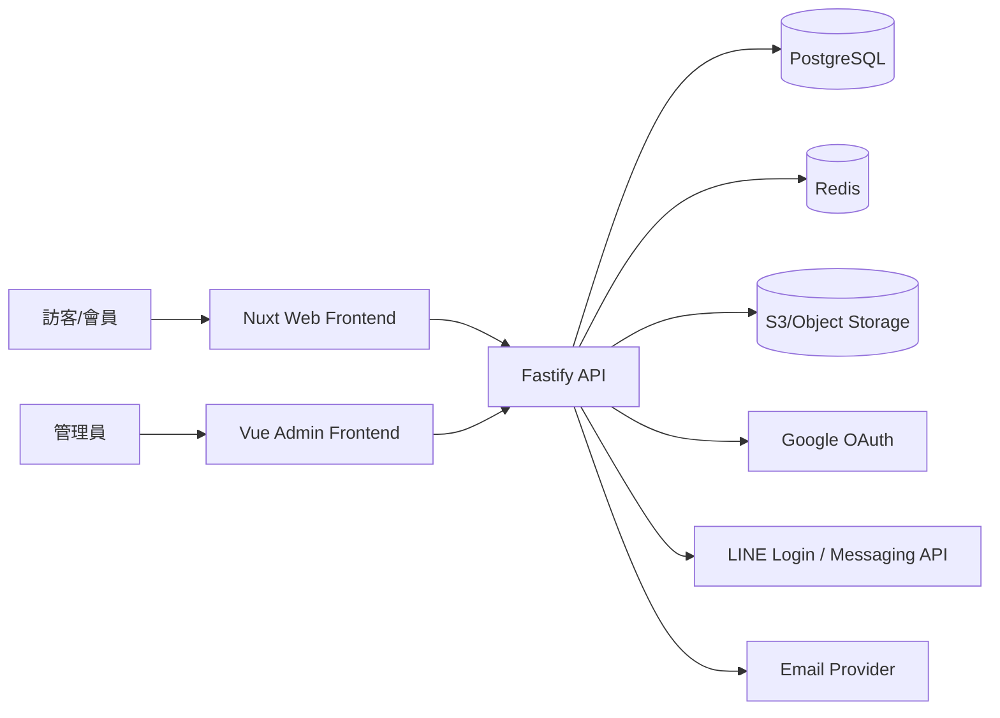

# AGENTS.md

本檔案提供給後續協作的開發者/AI Agent，快速理解此專案現況、架構與下一步。

## 1) Project Snapshot

- Project: `hotel-brand-booking`
- Stack:
  - Frontend: `Nuxt 3` (`apps/web`)
  - Admin: `Vue 3 + Vite` (`apps/admin`)
  - API: `Fastify + Zod` (`apps/api`)
  - Shared package: `packages/shared`
- Monorepo: npm workspaces + Turbo

## 2) Repository Structure

- `apps/web`: 前台官網（房型、首頁、預約、會員中心）
- `apps/admin`: 後台（目前為起始頁，後續擴充）
- `apps/api`: API（活動、匯款回填、健康檢查）
- `packages/shared`: 共用型別
- `docker-compose.yml`: 本機 Postgres / Redis

## 3) System Architecture



## 4) Current Feature Status

### Frontend (`apps/web`)
- [x] 首頁完成（Hero、近期活動、熱門房型）
- [x] 房型列表頁
- [x] 房型詳情頁（動態路由）
- [x] 預約頁（前端表單版）
- [x] 會員中心頁（樣板資料）
- [x] 全站統一 Header / Footer / Style Tokens
- [x] 串接 `GET /api/promotions/recent`
- [ ] 串接真實訂房建立 API
- [ ] Google 登入流程
- [ ] LINE 綁定流程

### API (`apps/api`)
- [x] `GET /health`
- [x] `GET /api/promotions/recent`
- [x] `GET /api/admin/promotions`
- [x] `POST /api/admin/promotions`
- [x] `PUT /api/admin/promotions/:id`
- [x] `DELETE /api/admin/promotions/:id`
- [x] `POST /api/remittance-submissions`
- [x] `GET /api/admin/remittance-submissions`
- [x] 本地 JSON persistence（promotions / remittances）
- [ ] 改為 PostgreSQL 正式資料層（Prisma）
- [ ] 後台登入授權與 RBAC

### Admin (`apps/admin`)
- [x] Vue3 + Vite 專案骨架
- [x] 可 build/typecheck
- [ ] 活動管理 CRUD 頁
- [ ] 匯款審核頁
- [ ] 會員查詢頁
- [ ] 後台操作審計頁

### Infra / DevOps
- [x] Monorepo 初始化
- [x] Docker Compose（Postgres + Redis）
- [x] Git repository initialized + pushed to GitHub
- [ ] Zeabur 三服務（web/admin/api）正式部署配置
- [ ] CI（lint/typecheck/build）

## 5) Priority TODO (Next)

1. [ ] **完成後台 UI（第一批）**：活動管理、匯款審核
2. [ ] **API 改用 PostgreSQL**：取代 JSON 檔案儲存
3. [ ] **接 Google Login + LINE 綁定**：會員真實登入流程
4. [ ] **訂房流程串接後端**：建立訂單/狀態追蹤
5. [ ] **Zeabur 上線**：web/admin/api + env vars + domain
6. [ ] **補測試**：API route tests + frontend smoke tests

## 6) Runbook

### Local run

```bash
# at repo root
npm install

# API (3000)
npm run dev --workspace @hotel/api

# Admin (5174)
npm run dev --workspace @hotel/admin

# Web (Nuxt)
npm run dev --workspace @hotel/web -- --host 0.0.0.0 --port 3001
```

### Production preview (web)

```bash
npm run build --workspace @hotel/web
PORT=3001 node apps/web/.output/server/index.mjs
```

## 7) Notes for Agents

- 目前前台以「視覺雛型 + 流程骨架」為主，訂房與會員尚未完整串後端。
- 後台尚未正式開發，請優先建立與前台一致的 UI 風格元件。
- 如需上線前驗證，至少執行：
  - `npm run typecheck --workspace @hotel/api`
  - `npm run build --workspace @hotel/api`
  - `npm run typecheck --workspace @hotel/admin`
  - `npm run build --workspace @hotel/admin`
  - `npm run build --workspace @hotel/web`
